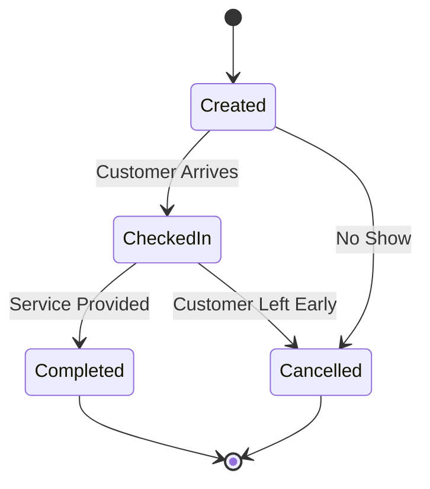
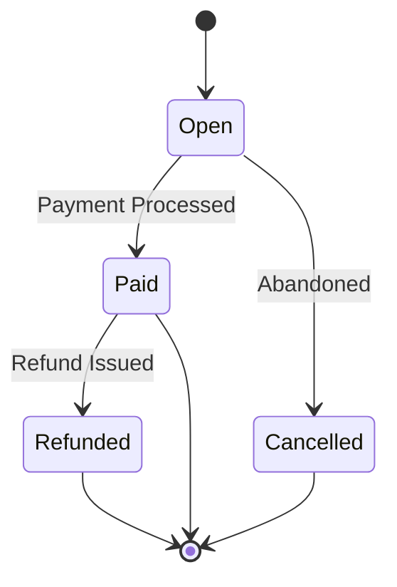

# Design: Meridian Check-In & Commerce Operations Portal

## 1. System Goal
The `Meridian Check-In & Commerce Operations Portal` is a full-stack application for managing:
- Customer or visitor physical check-ins.
- Counter or location-based walk-in operations.
- Simple point-of-sale commerce and order handling.
- Administrative settings, RBAC (Role-Based Access Control), and user management.

**Target Personas:**
- **Counter Operator:** Handles check-in flow, assists customers, processes orders and payments.
- **Location Manager:** Oversees daily location operations, handles overrides and local reporting.
- **System Admin:** Manages globally scoped settings, provisions new users and locations, accesses systemic reporting.

## 2. Recommended Stack

- **Frontend Language:** `rust`
- **Frontend Framework:** `yew` (compiled to WebAssembly)
- **Frontend Styling:** Raw CSS or standard utility framework (e.g., Tailwind CSS)
- **Backend Language:** `rust`
- **Backend Framework:** `actix-web` (async HTTP framework)
- **Database:** `postgresql` (primary operational datastore)
- **Serialization:** `serde` for JSON data interchange

## 3. High-Level Architecture

```mermaid
graph TD
    Client[Web Browser (Yew SPA)] -->|HTTP API| Server[Actix-Web Server]
    Server -->|SQL / sqlx| DB[(PostgreSQL)]
    
    subgraph Client-Side
        AuthStore[Session Store]
        UI[Component Tree]
    end
    
    subgraph Server-Side
        Router[API Router]
        Controllers[Handlers]
        Services[Business Logic]
        Repo[Data Access Layer]
    end
    
    Router --> Controllers
    Controllers --> Services
    Services --> Repo
```

## 4. Frontend Design

### Main Application Areas
- **Authentication:** Login, password reset.
- **Dashboard:** Operational summary, key metrics.
- **Check-ins:** Queue management, current active visitors, check-in log.
- **Orders / Commerce:** Product catalog, cart management, checkout.
- **Locations:** Managing sites and physical counters.
- **Admin Settings:** User provisioning, roles, system-wide configuration.

### Frontend Responsibilities
- Route-based navigation utilizing Yew Router.
- Authenticated session handling (e.g., managing JWTs or session cookies).
- Form validation before submission to minimize bad requests.
- Data tables with built-in client-side or server-driven pagination, filtering, and sorting.
- Dashboard summary rendering using lightweight graphing/charting.

### Suggested Page Structure
```text
frontend/
  src/
    app.rs              # Root application component and router
    pages/              # High-level route components
      login/
      dashboard/
      checkins/
      commerce/
      admin/
    components/         # Reusable UI widgets
      tables/
      forms/
      layout/
        navbar/
        sidebar/
    services/           # HTTP API client wrappers
    models/             # Typed data structures (often shared with backend)
    store/              # Frontend state management (if applicable)
```

## 5. Backend Design

### Backend Responsibilities
- Authentication and authorization layer.
- Enforcing business rules for the check-in lifecycle.
- Managing order creation, inventory (if tracked), and payment processing rules.
- Request payload validation and error normalization.
- Data access, including reporting queries and aggregations.

### Suggested Module Structure
```text
backend/
  src/
    main.rs             # Application entrypoint
    server.rs           # Actix-web server setup
    auth/               # Identity and access control
    checkins/           # Check-in lifecycle management
    orders/             # Commerce and order workflows
    products/           # Product catalog
    locations/          # Location provisioning
    dashboard/          # Pre-aggregated reporting data
    admin/              # User and system setting management
    db/                 # Database connection pooling and utilities
    errors/             # Global error handling and custom domain errors
    middleware/         # Request logging, auth checks
```

## 6. Core Domain Model

### User
- `id` (UUID, PK)
- `name` (String)
- `email` (String, Unique)
- `password_hash` (String)
- `role` (Enum: Root, Admin, Manager, Operator)
- `active` (Boolean)
- `created_at` (Timestamp)
- `updated_at` (Timestamp)

### Location
- `id` (UUID, PK)
- `name` (String)
- `code` (String, Unique)
- `active` (Boolean)
- `created_at` (Timestamp)

### CheckIn
- `id` (UUID, PK)
- `reference_no` (String, Unique)
- `customer_name` (String)
- `location_id` (UUID, FK -> Location.id)
- `status` (Enum: Expected, CheckedIn, Completed, Cancelled)
- `notes` (String)
- `checked_in_at` (Timestamp, Nullable)
- `completed_at` (Timestamp, Nullable)
- `cancelled_at` (Timestamp, Nullable)

### Product
- `id` (UUID, PK)
- `name` (String)
- `sku` (String, Unique)
- `price` (Decimal)
- `active` (Boolean)

### Order
- `id` (UUID, PK)
- `order_no` (String, Unique)
- `checkin_id` (UUID, FK -> CheckIn.id, Nullable)
- `status` (Enum: Open, Paid, Cancelled, Refunded)
- `total_amount` (Decimal)
- `created_at` (Timestamp)
- `updated_at` (Timestamp)

### OrderItem
- `id` (UUID, PK)
- `order_id` (UUID, FK -> Order.id)
- `product_id` (UUID, FK -> Product.id)
- `quantity` (Integer)
- `unit_price` (Decimal)
- `line_total` (Decimal)

### Payment
- `id` (UUID, PK)
- `order_id` (UUID, FK -> Order.id)
- `payment_method` (Enum: Cash, Card, Invoice)
- `amount` (Decimal)
- `paid_at` (Timestamp)

## 7. State Transitions

### Check-In Lifecycle


### Order Lifecycle


## 8. Security Design

- **Authentication:** All non-public routes require a valid session or JWT.
- **Authorization:** Role-Based Access Control (RBAC) enforced via Actix-web middlewares (e.g., only Managers/Admins can access `/api/admin/*`).
- **Data Protection:** 
  - Hashed passwords using Argon2 or bcrypt.
  - Server-side validation of all write operations.
  - CORS configuration restricted to specific front-end domains.
  - CSRF protections for session-based auth.
- **Auditing:** Audit-friendly timestamps (`created_at`, `updated_at`, `action_by`) on all critical entities.

## 9. Database Strategy & Notes

- **RDBMS:** PostgreSQL acts as the definitive system of record.
- **Primary Keys:** Use `UUIDv4` primary keys to prevent enumeration attacks and simplify distributed merging.
- **Indices:** Index standard filter fields to optimize reporting:
  - `reference_no`
  - `location_id`
  - `status`
  - `created_at`
- **Soft Deletes:** Where necessary (e.g., Users, Locations), prefer an `active: false` flag over hard deleting rows to maintain historical referential integrity.

## 10. Non-Goals (First Version)

- Advanced multi-warehouse inventory management.
- External automated payment gateway integration (Stripe, Square) - Cash/Card will be recorded manually.
- Complex multi-tenant partitioning (SaaS architecture).
- Offline or desktop synchronization (assumes stable online connection).

## 11. Delivery Recommendation Plan

1. **Phase 1: Shell & Core:** Authentication, app layout, User profile management.
2. **Phase 2: Master Data:** Locations and Product catalogs.
3. **Phase 3: Front Desk:** End-to-end check-in flow with state transitions.
4. **Phase 4: Commerce:** Orders, cart building, and simulated payment handling.
5. **Phase 5: Insights:** Dashboards, metrics, reporting APIs, and frontend visualizations.
6. **Phase 6: Polish:** Admin settings, advanced error handling, and end-to-end testing.
